# 9b – Secure File Transfer with FTPS

> **Status:** ✅ Completed

---

## Overview

In this phase, I added a separate FTPS service to `WIN-SRV01` for secure file transfer.

The existing SMB/DFS environment was not changed and continues to be used for departmental file sharing. FTPS was added as a separate service for transferring files from Windows, macOS, and remote devices.

The IIS FTP Server role was installed, and a separate data directory was created on the `D:` drive. Access was controlled with an Active Directory Security Group and NTFS permissions.

TLS encryption was enabled using a self-signed certificate. The service was tested from a Windows 11 domain client, a non-domain MacBook, and an iPhone connected remotely through WireGuard.

---

## 1. Install IIS FTP Server

The IIS FTP Server role was installed on `WIN-SRV01`.

After the installation, the FTP Server feature was available in IIS Manager.

| IIS FTP Server Installation |
|:---------------------------:|
| 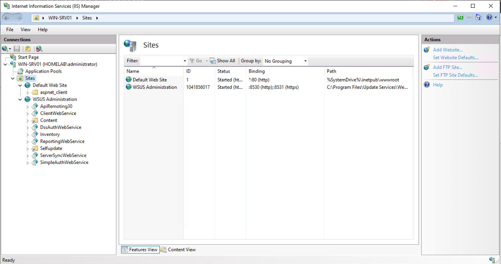 |

---

## 2. Create the FTPS Access Group

A new Active Directory Global Security Group named `GG_FTPS_USERS` was created.

Users who need FTPS access can be added to this group without changing the existing OU structure.

| Active Directory Access Group |
|:-----------------------------:|
| 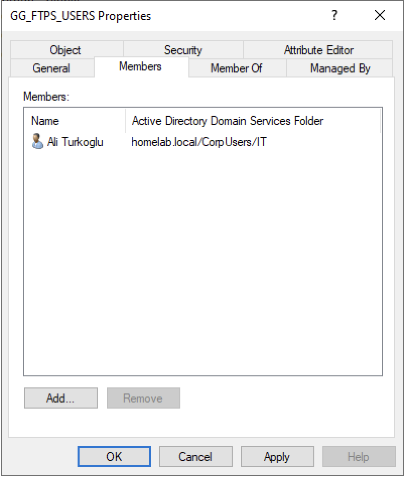 |

---

## 3. Configure the Data Directory and NTFS Permissions

A separate folder named `D:\FTP-Data` was created for the FTPS service.

NTFS inheritance was disabled on this folder.

The permissions were configured as follows:

- **Administrators** → Full Control
- **SYSTEM** → Full Control
- **GG_FTPS_USERS** → Modify

This keeps access to the FTPS data separate from the existing SMB/DFS folders.

| NTFS Permissions Configuration |
|:------------------------------:|
| 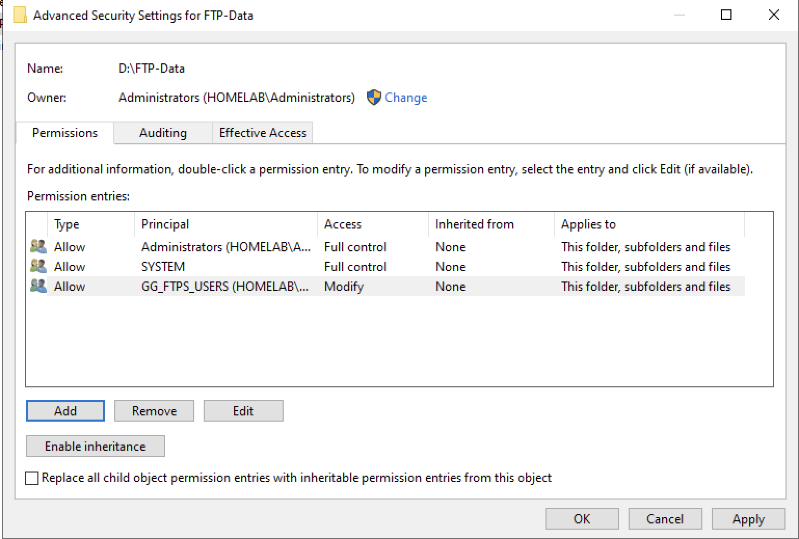 |

---

## 4. Create the TLS Certificate

A self-signed certificate named `WIN-SRV01-FTPS` was created for the HomeLab environment.

The certificate is used by the FTP site to provide TLS encryption.

| TLS Certificate |
|:---------------:|
| 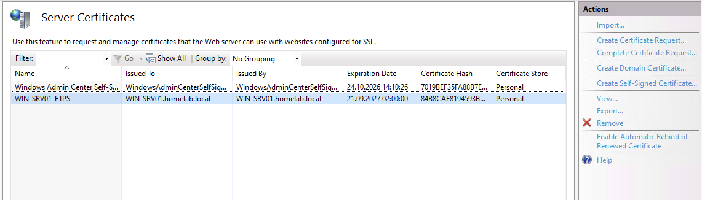 |

---

## 5. Create and Configure the FTPS Site

The FTP site was configured as **Explicit FTPS** on TCP port `21`.

SSL is required for the connection. Basic Authentication is enabled, and access is limited to members of the `GG_FTPS_USERS` group.

The site uses `D:\FTP-Data` as its physical directory and allows authorized users to read and write files.

| FTPS Binding (Require SSL) | Authentication & Authorization |
|:--------------------------:|:------------------------------:|
| 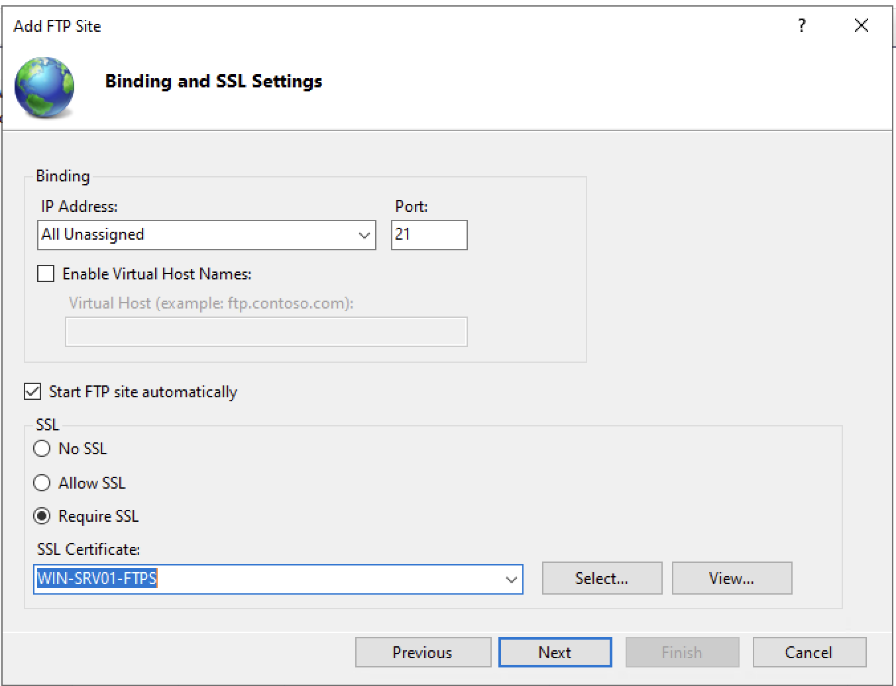 | 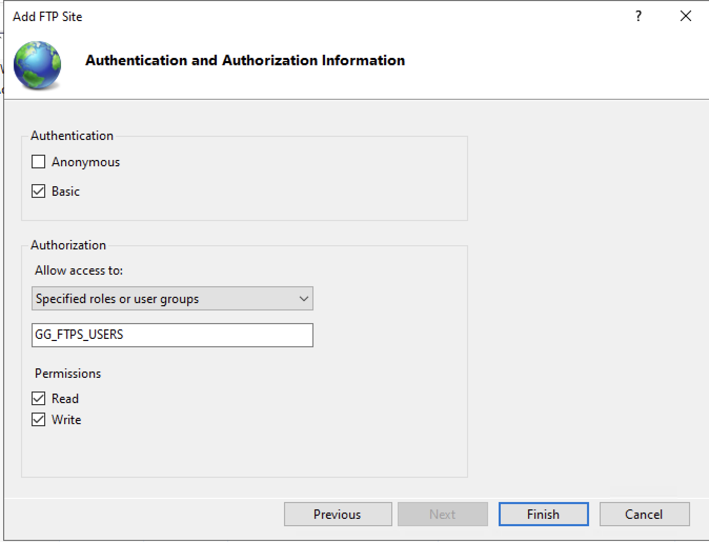 |

After the configuration was completed, the new FTPS site was running in IIS.

| FTPS Site Running |
|:-----------------:|
| 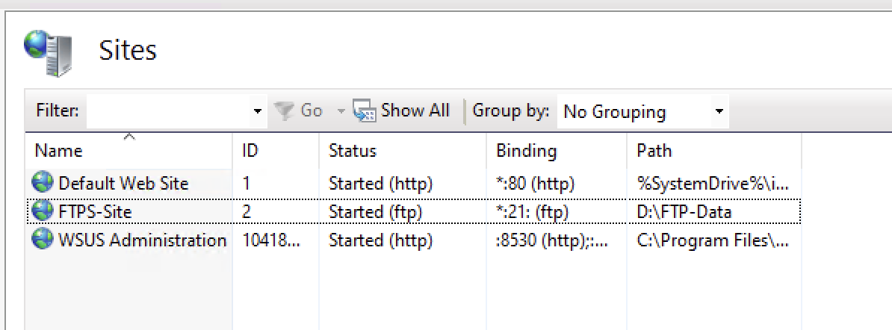 |

---

## 6. Configure Passive FTP

The passive data port range was configured as `50000-50100` in IIS.

The Windows Firewall passive FTP rule was also changed to use the same port range.

| Passive FTP Firewall Support |
|:----------------------------:|
| 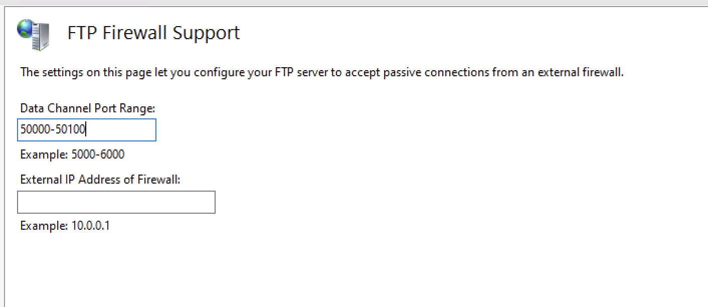 |

---

## 7. Test from the Windows Client

The FTPS connection was tested from `WIN11-CL01` using WinSCP.

The client connected to `WIN-SRV01.homelab.local` using Explicit FTPS on TCP port `21`. A domain account that belongs to `GG_FTPS_USERS` was used for authentication.

A test file on the server was listed successfully. A PDF file was then uploaded from the Windows client and verified in `D:\FTP-Data` on `WIN-SRV01`.

The file was also downloaded back to `WIN11-CL01`. This confirmed that the FTPS connection and file transfers were working in both directions.

| WinSCP Client Connection Test |
|:-----------------------------:|
| 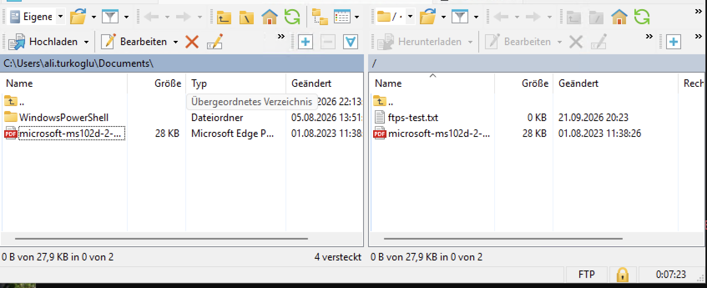 |

---

## 8. Test from a Non-Domain macOS Client

The FTPS service was also tested from a MacBook that is not joined to the Active Directory domain.

At first, the MacBook could not resolve `WIN-SRV01.homelab.local`. The HomeLab DNS server (`192.168.x.x`) was added to the MacBook DNS configuration.

After this change, the server name resolved correctly.

FileZilla was configured to use Explicit FTPS on TCP port `21`. An Active Directory account from `GG_FTPS_USERS` was used for authentication.

A file was successfully uploaded from the MacBook to the FTPS server. This test showed that a device does not need to be joined to the domain to use the FTPS service.

| macOS FileZilla Connection Test |
|:-------------------------------:|
| 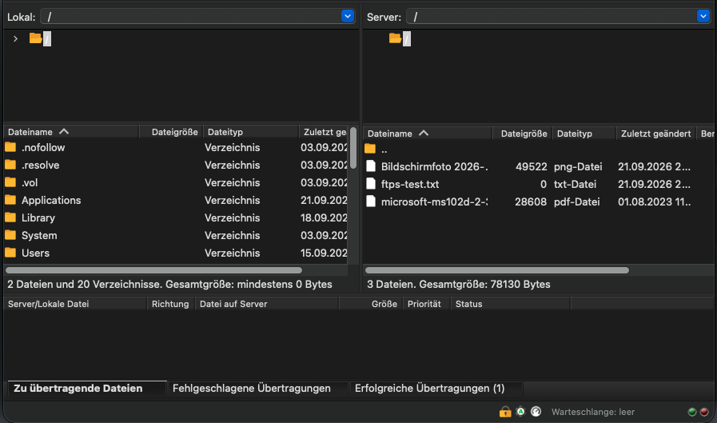 |

---

## 9. Test Secure Remote Access over WireGuard

Remote FTPS access was also tested from an iPhone using a 5G mobile connection.

The iPhone connected to the HomeLab through the existing WireGuard VPN. The HomeLab DNS server (`192.168.x.x`) was added to the WireGuard client configuration so that `WIN-SRV01.homelab.local` could be resolved through the VPN tunnel.

FTPManager was configured to require Explicit FTP over TLS on TCP port `21`.

The FTPS directory was successfully accessed through the VPN and a file was uploaded to `WIN-SRV01`.

The FTPS service was not exposed directly to the Internet. Remote access is provided through the existing WireGuard VPN.

| Remote Access via iPhone (WireGuard) |
|:------------------------------------:|
| 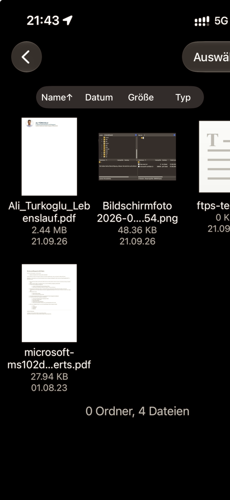 |

---

## 10. Troubleshooting

During the first Windows client test, WinSCP returned a connection timeout.

`Test-NetConnection` showed that the server name could be resolved and the server was reachable, but TCP port `21` was not available.

On `WIN-SRV01`, `Get-NetTCPConnection` showed that port `21` was not listening.

The Microsoft FTP Service was restarted. After the restart, port `21` was listening and the WinSCP connection worked.

A second issue occurred during the macOS test. The MacBook was using the home router for DNS and could not resolve the internal HomeLab server name.

The HomeLab DNS server was added to the MacBook network settings, and `WIN-SRV01.homelab.local` then resolved correctly.

---

## 11. Current Storage

The FTPS service currently uses `D:\FTP-Data` on the existing D: drive.

Approximately 20 GB of free space is currently available. This is enough for the current HomeLab file transfer tests and small files.

Dedicated storage may be added to the Proxmox host later if more FTPS storage is needed for larger data transfers.

---

## Lessons Learned

- FTPS can be added as a separate service without changing the existing SMB/DFS file-sharing environment.
- Active Directory Security Groups can also be used to control access to the FTPS service.
- NTFS permissions still control access to the files stored on the server.
- Explicit FTPS uses TLS to protect the FTP connection.
- Passive FTP requires a separate data port range.
- Non-domain devices can use the FTPS service with an Active Directory account.
- Internal DNS is important when non-domain devices need to access HomeLab servers by name.
- WireGuard can be used to reach the FTPS service remotely without exposing the FTPS service directly to the Internet.

---

## Navigation

| Previous | Home | Next |
|:--------:|:----:|:----:|
| ⬅️ [Active Directory Organization & Secure File Sharing](../9-Active-Directory-Organization&Security-File-Sharing/README.md) | 🏠 [Home](../../README.md) | ➡️ [Print Server Configuration](../10–Print-Server-Configuration/README.md) |
